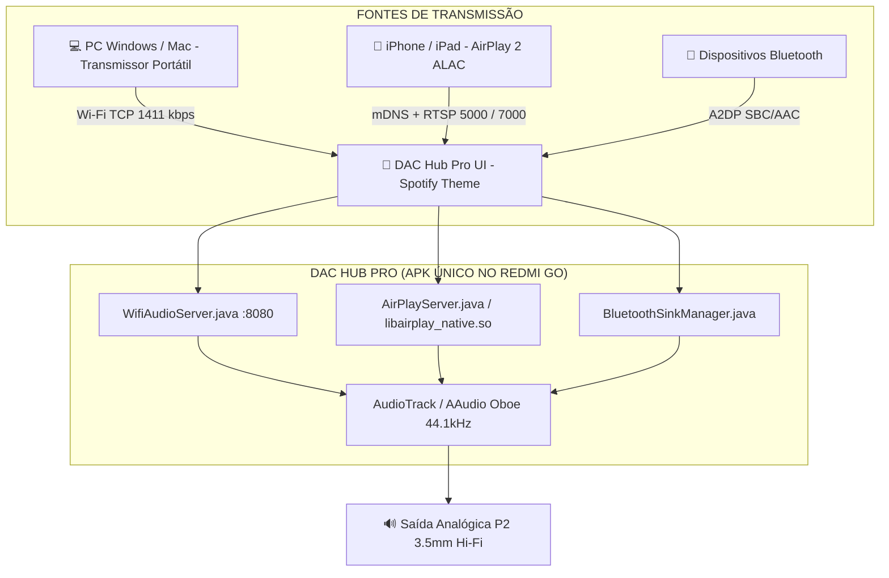

# 📻 PROJETO DAC REDMI GO (DAC HUB PRO) — PREMISSAS & DIRETRIZES

Este documento define a arquitetura, regras operacionais e premissas fundamentais do projeto **DAC-REDMI-GO**, transformando o smartphone Xiaomi Redmi Go em um **Receptor DAC de Áudio Hi-Fi de Alta Fidelidade (Lossless)** dedicado.

---

## 🎯 1. Premissas Fundamentais do Projeto

1. **Finalidade do Dispositivo:**
   * O Xiaomi Redmi Go (`tiare`, MSM8937) opera como um **DAC / Receptor de Áudio Dedicado**, conectado permanentemente via cabo P2 3.5mm a caixas de som amplificadas ou amplificadores Hi-Fi.
2. **Qualidade Sonora Inegociável (Hi-Fi Lossless):**
   * O áudio transmitido deve ser **PCM 16-bit / 24-bit 44.1kHz / 48kHz (1411 kbps+)** sem compressão lossy (sem perdas de estúdio).
3. **Suporte Multiplataforma Integrado em App Único (`DAC Hub Pro`):**
   * **Windows / Linux / Mac (PC):** Transmissão direta sem perdas via rede local Wi-Fi (TCP socket de baixa latência).
   * **Apple iOS (iPhone / iPad / Mac):** Receptor **Apple AirPlay 2** nativo integrado com decodificação ALAC via C++ (`libairplay_native.so` e `liboboe.so`).
   * **Smartphones Android / Genéricos:** Receptor de Áudio Bluetooth (A2DP Sink).
4. **Identidade Visual:**
   * Interface moderna inspirada na paleta e usabilidade do **Spotify** (Preto `#121212`, Superfície `#181818` / `#242424` e Verde Spotify `#1DB954`).
5. **Idioma:**
   * Todo o diálogo, documentação, commits e comunicação devem respeitar o Português do Brasil (`pt-BR`).

---

## 🏗️ 2. Arquitetura do Sistema



---

## 🛠️ 3. Comandos Canônicos de Build e Deploy

- **Compilar APK Completo com C++ Nativo:**
  ```powershell
  powershell.exe -ExecutionPolicy Bypass -File scripts\build_apk.ps1
  ```
- **Instalar APK no Redmi Go via ADB:**
  ```powershell
  .\tools\platform-tools\adb.exe install -r -d -t dist\DAC_Hub_Pro.apk
  ```
- **Reiniciar o App no Aparelho:**
  ```powershell
  .\tools\platform-tools\adb.exe shell "am force-stop com.dachub.audio; am start -n com.dachub.audio/.MainActivity"
  ```
- **Tirar Print da Tela em Tempo Real:**
  ```powershell
  .\tools\platform-tools\adb.exe shell screencap -p /sdcard/live.png
  .\tools\platform-tools\adb.exe pull /sdcard/live.png tools/live.png
  ```
- **Compilar Transmissor Portátil do Windows (PC):**
  ```powershell
  powershell.exe -ExecutionPolicy Bypass -File scripts\build_transmitter.ps1
  ```

---

## 📋 4. Diretrizes de Desenvolvimento

1. **Nunca quebrar a compatibilidade com o conector P2:** A taxa de amostragem padrão é `44100 Hz`, canal `CHANNEL_OUT_STEREO`, codificação `ENCODING_PCM_16BIT`.
2. **Zero dependências externas desnecessárias:** O build utiliza ferramentas portáteis em `tools/` sem exigir Android Studio instalado na máquina.
3. **Mantenha o repositório GitHub sincronizado:** Todos os avanços significativos devem ser commitados e enviados para o repositório remoto `https://github.com/d0mb/DAC-REDMI-GO.git`.
